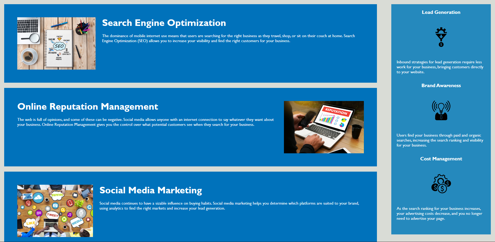

# Code Refactor

## Description

I was given base code for a company website and I refactored it to be more HTML semantic.
Through doing this I gained an understanding of semantic html elements.

## Usage

Go to the deployed link and explore the Horiseon company website.
Below is a link to the deployed application:

- https://afaidley.github.io/WK1-HW-Code-Refactor/

    
    

## Credits

- Denver University staff
- https://stackoverflow.com/questions/36509163/html5-semantic-structure-for-a-navbar
- https://www.w3schools.com/html/html5_semantic_elements.asp
- https://coding-boot-camp.github.io/full-stack/github/professional-readme-guide